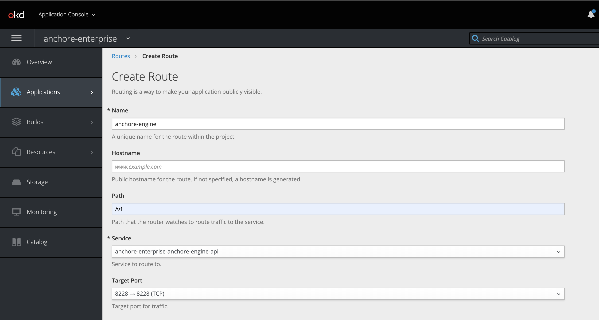
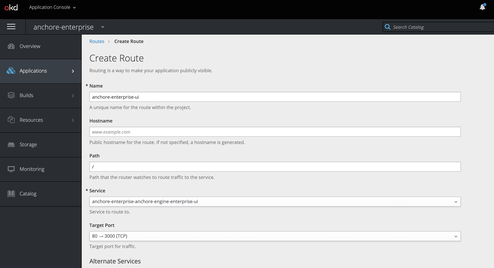
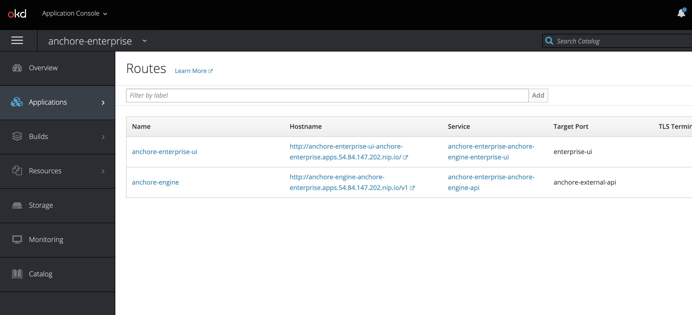

# Anchore Enterprise Installation on OKD 3.11

This document will walkthrough installing Anchore Enterprise on OpenShift Kubernetes Distribution (OKD) 3.11 with Helm. Anchore maintains a Helm chart for simplifying the deployment. You can find out more information by checking out the [GitHub Repository](https://github.com/helm/charts/tree/master/stable/anchore-engine) for the chart. 

## Prerequisites

- OpenShift Kubernetes Distribution (OKD) 3.11 cluster installed. Read more about the installation requirements [here](https://docs.okd.io/3.11/install/running_install.html).
- [Helm](https://helm.sh/) client and server installed and configured within your OKD cluster.

**Considerations for Helm on OpenShift:**

- The Helm client doesn't current set up the service account rolebindings that OpenShift wants. There is a template that does everything needed for this. https://raw.githubusercontent.com/openshift/origin/master/examples/helm/tiller-template.yaml

```
$ wget -q https://github.com/openshift/origin/raw/master/examples/helm/tiller-template.yaml
$ oc process -p TILLER_NAMESPACE=$TILLER_NAMESPACE \
    -p HELM_VERSION=v2.14.3 -f tiller-template.yaml > tiller.yaml
$ oc create -f tiller.yaml
serviceaccount "tiller" created
role "tiller" created
rolebinding "tiller" created
deployment "tiller" created
```

## Anchore Helm Chart

Anchore maintains a [Helm chart] to simplify the software installation process. An Enterprise installation of the chart will include the following:

- Anchore Enterprise Software
- PostgreSQL (9.6.2)
- Redis 4

To make the necessary configurations to the Helm chart, create a custom `anchore_values.yaml` file and reference it during installation. There are many options for configuration with Anchore, this document is intended to cover the minimum required changes to successfully install Anchore Enterprise on OKD 3.11.

### OpenShift Configurations

#### Create a new project

Create a new project called anchore-enterprise:

`oc new-project anchore-enterprise`

#### Grant edit access to the tiller server

Grant edit access to the tiller server so it can modify the new project

```
oc policy add-role-to-user edit \
"system:serviceaccount:${TILLER_NAMESPACE}:tiller"
role "edit" added: "system:serviceaccount:tiller:tiller"
```

### Create secrets

Two secrets are required for an Anchore Enterprise installation.

Create a secret for the license file:
`oc create secret generic anchore-enterprise-license --from-file=license.yaml=license.yaml`

Create a secret for pulling the images:
`oc create secret docker-registry anchore-enterprise-pullcreds --docker-server=docker.io --docker-username=<username> --docker-password=<password> --docker-email=<email>`

Verify these secrets are in the correct namespace: anchore-enterprise

`oc describe secret <secret-name>`

#### Link ImagePullSecret

Link the above Docker registry secret to the default service account:

`oc link default anchore-enterprise-pullcreds --for=pull --namepsace=anchore-enterprise`

Verify this by running the following:

`oc describe sa`

**Note:** Validate your OpenShift SCC. Based on the security constraints of your environment, you may need to change SCC. `oc adm policy add-scc-to-user anyuid -z default`

### Anchore Configurations

Create a custom `anchore_values.yaml` file for your Anchore Enterprise deployment:

```
postgresql:
  image: registry.access.redhat.com/rhscl/postgresql-96-rhel7
  imageTag: latest
  extraEnv:
  - name: POSTGRESQL_USER
    value: anchoreengine
  - name: POSTGRESQL_PASSWORD
    value: anchore-postgres,123
  - name: POSTGRESQL_DATABASE
    value: anchore
  - name: PGUSER
    value: postgres
  - name: LD_LIBRARY_PATH
    value: /opt/rh/rh-postgresql96/root/usr/lib64
  - name: PATH
    value: /opt/rh/rh-postgresql96/root/usr/bin:/opt/app-root/src/bin:/opt/app-root/bin:/usr/local/sbin:/usr/local/bin:/usr/sbin:/usr/bin:/sbin:/bin
  persistence:
    size: 20Gi

anchoreGlobal:
  openShiftDeployment: True

anchoreEnterpriseGlobal:
  enabled: True

anchore-feeds-db:
  image: registry.access.redhat.com/rhscl/postgresql-96-rhel7
  imageTag: latest
  extraEnv:
  - name: POSTGRESQL_USER
    value: anchoreengine
  - name: POSTGRESQL_PASSWORD
    value: anchore-postgres,123
  - name: POSTGRESQL_DATABASE
    value: anchore-feeds
  - name: PGUSER
    value: postgres
  - name: LD_LIBRARY_PATH
    value: /opt/rh/rh-postgresql96/root/usr/lib64
  - name: PATH
    value: /opt/rh/rh-postgresql96/root/usr/bin:/opt/app-root/src/bin:/opt/app-root/bin:/usr/local/sbin:/usr/local/bin:/usr/sbin:/usr/bin:/sbin:/bin
  persistence:
    size: 30Gi

anchore-ui-redis:
  password: anchore-postgres,123
```

#### Install

Run the following command to install the software:

`helm install --name anchore-enterprise -f values.yaml stable/anchore-engine`

It will take the system several minutes to bootstrap. You can checks on the status of the pods by running `oc get pods`:

```
$ oc get pods
NAME                                                              READY     STATUS    RESTARTS   AGE
anchore-enterprise-anchore-engine-analyzer-cfddf6b56-9pwm9        1/1       Running   0          15h
anchore-enterprise-anchore-engine-api-5b5bffc79f-vmwvl            4/4       Running   0          15h
anchore-enterprise-anchore-engine-catalog-b88d4dff4-jhm4t         1/1       Running   0          15h
anchore-enterprise-anchore-engine-enterprise-feeds-5956cdbrkd62   1/1       Running   0          15h
anchore-enterprise-anchore-engine-enterprise-ui-7d8fdb69d858bxc   1/1       Running   0          15h
anchore-enterprise-anchore-engine-policy-84b6dbdfd-fvnll          1/1       Running   0          15h
anchore-enterprise-anchore-engine-simplequeue-dc58c69c9-5rmj9     1/1       Running   0          15h
anchore-enterprise-anchore-feeds-db-fc665b76-9q6rb                1/1       Running   0          15h
anchore-enterprise-anchore-ui-redis-master-0                      1/1       Running   0          15h
anchore-enterprise-postgresql-795fd9c476-5z526                    1/1       Running   0          15h
```

### Create route objects

Create two route object in OpenShift to expose the UI and API services:

#### API Route


#### UI Route


#### Routes


Verify by navigating to the anchore-enterprise-ui route hostname:


Verify API route via the Anchore CLI:

```
$ anchore-cli --url http://anchore-engine-anchore-enterprise.apps.54.84.147.202.nip.io/v1 --u admin --p foobar system status
Service rbac_manager (anchore-enterprise-anchore-engine-api-5b5bffc79f-vmwvl, http://anchore-enterprise-anchore-engine-api:8229): up
Service analyzer (anchore-enterprise-anchore-engine-analyzer-cfddf6b56-9pwm9, http://anchore-enterprise-anchore-engine-analyzer:8084): up
Service apiext (anchore-enterprise-anchore-engine-api-5b5bffc79f-vmwvl, http://anchore-enterprise-anchore-engine-api:8228): up
Service reports (anchore-enterprise-anchore-engine-api-5b5bffc79f-vmwvl, http://anchore-enterprise-anchore-engine-enterprise-reports:8558): up
Service simplequeue (anchore-enterprise-anchore-engine-simplequeue-dc58c69c9-5rmj9, http://anchore-enterprise-anchore-engine-simplequeue:8083): up
Service policy_engine (anchore-enterprise-anchore-engine-policy-84b6dbdfd-fvnll, http://anchore-enterprise-anchore-engine-policy:8087): up
Service rbac_authorizer (anchore-enterprise-anchore-engine-api-5b5bffc79f-vmwvl, http://localhost:8089): up
Service catalog (anchore-enterprise-anchore-engine-catalog-b88d4dff4-jhm4t, http://anchore-enterprise-anchore-engine-catalog:8082): up

Engine DB Version: 0.0.11
Engine Code Version: 0.5.0
```
